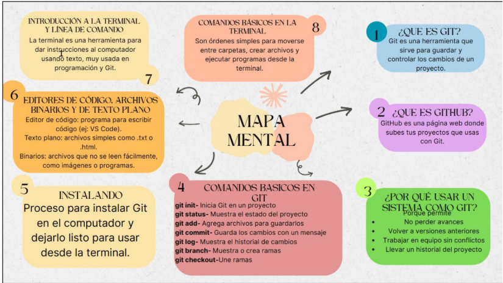
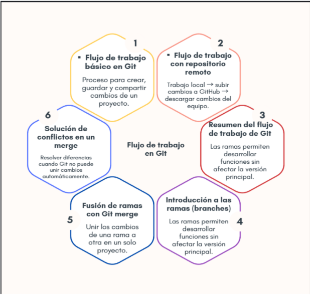
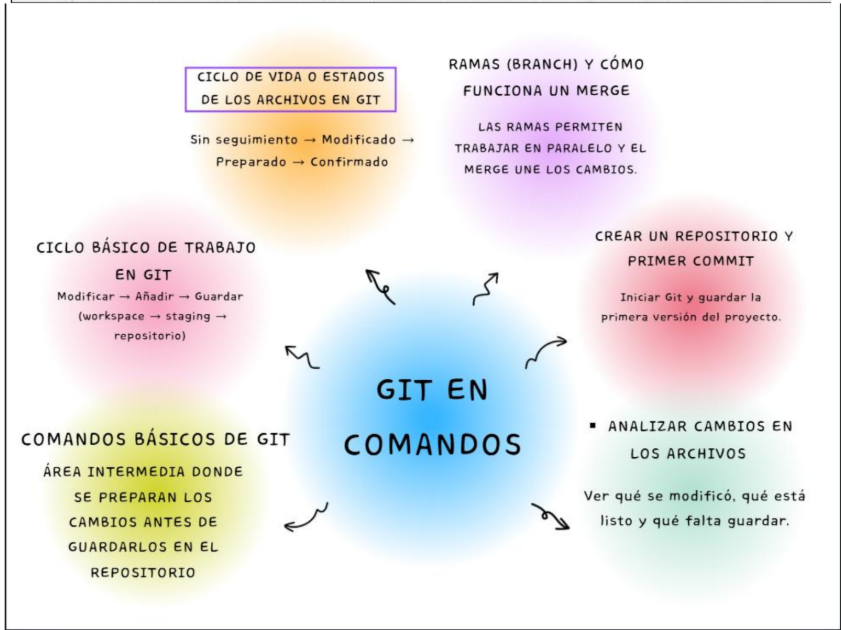
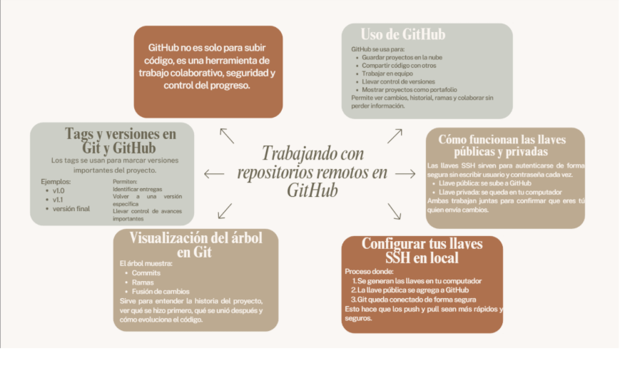

# Mapas conceptuales – Clase del martes

Este repositorio contiene los mapas conceptuales trabajados en la clase del martes,
relacionados con el análisis de procesos y la ingeniería de sistemas.

## Objetivo
Presentar de forma visual y estructurada los conceptos vistos en clase mediante mapas conceptuales.

## Contenido de los mapas

### 🗺️ Mapa 1 – Teoría General de Sistemas
Es una teoría que dice que todo puede verse como un sistema.

Un sistema:

-Tiene entradas

-Procesa algo

-Genera salidas

-Está formado por partes que se relacionan

---

### 🗺️ Mapa 2 – Enfoque de sistemas
Es una forma de analizar algo viendo el todo y no solo las partes.

No se estudia cada elemento por separado, sino:

Cómo se relacionan

Cómo trabajan juntos

Cómo afectan el resultado final

---

### 🗺️ Mapa 3 – Definición de los sistemas
Un sistema es:

Un conjunto de elementos que interactúan entre sí para lograr un objetivo.

Características:

Tiene límites

Tiene objetivo

Tiene entradas y salidas

Tiene retroalimentación (feedback)

---

### 🗺️ Mapa 4 –Análisis de los procesos a nivel de negocio
Es estudiar cómo funciona una empresa internamente.

Se analiza:

Qué actividades se hacen

Quién las hace

En qué orden

Cómo se puede mejorar

